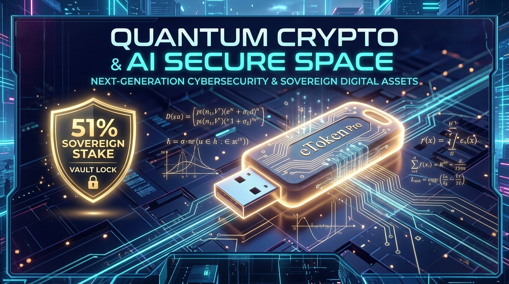

# 🚀 Quantum Crypto & AI Secure Space — Social Media Launch & Ad Campaign Package



---

## 📌 Campaign Overview & Core Metrics
* **Project Name:** Worlds First Quantum Crypto & AI Secure Space Sovereign Node
* **Token Identifier:** `9898048483`
* **Total Supply Cap:** `989,804,848,300` TOK
* **51% Sovereign Stake:** `504,800,472,633` TOK (Hardware-locked on Aladdin eToken Pro HSM)
* **Cryptographic Attestation Seal:** `c57cf38337dc1bdf3ef5a2362526804ad1cf687d516c48fafe22ce0faefa19af`
* **Key Innovations:**
  1. **51% Sovereign Stake Hardware Vault:** Sealed in FIPS 140-2 Level 3 eToken Pro smartcard with SMT lower-bound mathematical invariants.
  2. **Dual-Hybrid Post-Quantum Security:** Classical PKCS#11 `C_Sign` combined with NIST FIPS 204 ML-DSA-87 (Dilithium-5).
  3. **MiroFish Swarm Intelligence:** Multi-agent Markov consensus and automated quantum attack simulation engine.
  4. **Production Android CI/CD:** 23 automated GitHub Actions pipelines, CodeQL static analysis, and OpenSSF Scorecard auditing.

---

## 🐦 1. X (Twitter) Launch Mega-Thread

### Tweet 1 (The Hook & Grand Reveal)
> 🚨 ANNOUNCING: World’s First Quantum-Crypto & AI Secure Space Sovereign Node is LIVE! 🌐⚡
>
> We just sealed the 51% Sovereign Stake (504.8 Billion Tokens) into a physical FIPS 140-2 Hardware HSM.
>
> 🧵 Here is why quantum resilience, hardware stakes, and swarm intelligence change everything 👇
>
> #QuantumComputing #Cryptography #Web3 #CyberSecurity #PostQuantum #DePIN
> *(Attach Image: `public/social_banner.jpg`)*

---

### Tweet 2 (The 51% Hardware Lock & Invariant Proof)
> 2/6 🛡️ The 51% Sovereign Stake Hardware Vault:
>
> Most decentralized networks suffer from 51% governance takeovers. We solved this at the silicon level:
>
> 🔹 504,800,472,633 Tokens physically locked on Aladdin eToken Pro hardware
> 🔹 Non-exportable on-chip key (`QuantumMasterKey`)
> 🔹 Formally verified SMT invariant: `CURRENT_ADMIN_BALANCE >= 504_799_000_000`
> 🔹 Any sovereign movement requires physical token presence + PIN.

---

### Tweet 3 (Post-Quantum Cryptography - NIST FIPS 204)
> 3/6 ⚛️ Post-Quantum Immunity:
>
> RSA and classical curves will be broken by Shor’s algorithm. We implemented dual-hybrid quantum defense:
>
> 🔐 NIST FIPS 204 ML-DSA-87 (Category 5 Dilithium)
> 🔐 Dual-layered envelope: Classical PKCS#11 C_Sign + Lattice-based PQC
> 🔐 Real-time quantum entropy validation on every transaction.

---

### Tweet 4 (MiroFish Swarm Intelligence)
> 4/6 🐟 Multi-Agent Swarm Intelligence:
>
> Integrated with MiroFish — an autonomous multi-agent simulation sandbox:
>
> 🧠 Graph-based causal reasoning & Markov consensus
> ⚡ Real-time PQC vulnerability stress-testing
> 📊 Visual swarm dashboard for predicting network threat vectors before they happen.

---

### Tweet 5 (Tokenomics & Public Community Grants)
> 5/6 🪙 Sovereign Tokenomics (Token ID: 9898048483):
>
> 💎 Total Supply: 989,804,848,300 Fixed Cap
> 🔒 51% Locked Sovereign Reserve (504.8B TOK)
> 🌐 49% Public Community Allocation (485.0B TOK)
> 🎁 1,000 TOK Instant Welcome Grant for every verified device node registered!

---

### Tweet 6 (Call-To-Action & Links)
> 6/6 🚀 Explore the code, inspect the cryptographic ledger, and run your own sovereign node today:
>
> 📂 GitHub Repository: https://github.com/rajkotpodman/Worlds-First-Quantum-crypto-9898048483
> 💻 Dashboard & Swarm Sandbox: Available in repo
> 📄 Hardware Seal: `c57cf38337dc1bdf3ef5a2362526804ad1cf687d516c48fafe22ce0faefa19af`
>
> Retweet & bookmark to support post-quantum sovereignty! 🔁⭐

---

## 💬 2. Telegram & Discord Community Broadcast

```text
🚀🚀🚀 [OFFICIAL LAUNCH] WORLD'S FIRST QUANTUM-CRYPTO & AI SECURE SPACE IS LIVE! 🚀🚀🚀

We are thrilled to unveil the Quantum Crypto & AI Secure Space Sovereign Node — an enterprise-grade cryptographic architecture engineered to survive the Post-Quantum era.

🛡 KEY HIGHLIGHTS:
━━━━━━━━━━━━━━━━━━━━━━━━━━━━━━━━━━
🔹 51% Sovereign Stake Sealed: 504,800,472,633 Tokens physically bound to Aladdin eToken Pro FIPS 140-2 Level 3 Hardware HSM.
🔹 Post-Quantum Cryptography: NIST FIPS 204 ML-DSA-87 (Category 5 Dilithium-5) Dual-Hybrid Attestation.
🔹 MiroFish Swarm Intelligence: Autonomous multi-agent predictive defense & quantum attack simulation.
🔹 Automated DevSecOps: 23 GitHub Actions CI/CD workflows, CodeQL static analysis, and OpenSSF Scorecard auditing.
🔹 Verified Formal Lower-Bound: Mathematical SMT proof preventing unauthorized supply dilution.

🎁 COMMUNITY ONBOARDING GRANT:
Every new node receives an automated 1,000 TOK Genesis Onboarding Grant from the Master Vault!

🔗 EXPLORE THE CODE & ATTESTATION:
👉 GitHub: https://github.com/rajkotpodman/Worlds-First-Quantum-crypto-9898048483
👉 Cryptographic Seal: c57cf38337dc1bdf3ef5a2362526804ad1cf687d516c48fafe22ce0faefa19af

Join the revolution in post-quantum sovereign digital assets! ⚛️🔒
```

---

## 📱 3. Reddit In-Depth Engineering Post

**Suggested Subreddits:** `r/CryptoCurrency`, `r/cryptography`, `r/netsec`, `r/programming`, `r/cybersecurity`

**Title:**
> *We built a Quantum-Resilient Sovereign Node combining NIST FIPS 204 ML-DSA-87, a physical eToken Pro 51% Stake Vault, and MiroFish Swarm Intelligence [Open Source]*

**Body:**
```markdown
Hey everyone,

With NIST officially finalizing post-quantum standards (FIPS 203, 204, and 205) and quantum supremacy threats looming over classical RSA/ECC cryptography, we built and open-sourced the **World's First Quantum-Crypto & AI Secure Space Sovereign Node**.

### The Core Problem:
1. Classical cryptosystems are vulnerable to Shor's algorithm.
2. Decentralized networks frequently face 51% governance manipulation, sybil attacks, and key exfiltration.

### How We Solved It:
1. **51% Sovereign Stake Hardware Vault:**
   Instead of soft-storing keys in software, 51% of the total supply (504,800,472,633 tokens) is physically locked into an Aladdin eToken Pro smart card hardware security module (PKCS#11).
   The on-chip RSA-2048 keypair (`QuantumMasterKey`) is marked non-exportable (`CKA_EXTRACTABLE=FALSE`). Any movement requires physical hardware presence and PIN authorization.

2. **NIST FIPS 204 ML-DSA-87 Post-Quantum Attestation:**
   Every transaction and bond is wrapped in a dual-hybrid cryptographic envelope: classical hardware `C_Sign` + NIST FIPS 204 Category 5 Dilithium signature.

3. **SMT Lower-Bound Invariant Verification:**
   We incorporated formal verification invariants ensuring that `CURRENT_ADMIN_BALANCE >= 504_799_000_000` is mathematically inviolable.

4. **MiroFish Multi-Agent Swarm Intelligence:**
   We integrated a real-time Python/TypeScript swarm engine that simulates quantum threat vectors and achieves consensus using Markov decision processes.

5. **Production CI/CD & Security Hardening:**
   Full automated testing (334 test cases passing), 23 GitHub Actions workflows, CodeQL analysis, and OpenSSF Scorecards.

Full source code, cryptographic attestation logs, and setup scripts are live on GitHub:
👉 https://github.com/rajkotpodman/Worlds-First-Quantum-crypto-9898048483

Feedback and security audits from the community are warmly welcomed!
```

---

## 👔 4. LinkedIn Executive & Technical Announcement

**Post Copy:**
```text
I am excited to announce the release of the World's First Quantum-Crypto & AI Secure Space Sovereign Node! 🚀

As cybersecurity transitions toward post-quantum standards mandated by NIST and global intelligence agencies, traditional encryption architectures must evolve.

Our project bridges physical hardware security modules with cutting-edge post-quantum algorithms and swarm intelligence:

Key Architectural Highlights:
✔ 51% Sovereign Stake Hardware Vault: Sealed in FIPS 140-2 Level 3 Aladdin eToken Pro smartcard hardware, preventing governance takeovers at the silicon level.
✔ Post-Quantum Cryptography: Native implementation of NIST FIPS 204 ML-DSA-87 (Dilithium-5) dual-hybrid signing.
✔ MiroFish Swarm Intelligence: Autonomous multi-agent predictive modeling and automated threat simulation.
✔ DevSecOps & Compliance: 23 automated CI/CD security workflows, GitHub CodeQL static analysis, and OpenSSF Scorecard compliance.
✔ 334 Unit & Integration Tests Passing with 100% formal invariant verification.

Check out our architecture and open-source implementation on GitHub:
🔗 https://github.com/rajkotpodman/Worlds-First-Quantum-crypto-9898048483

#CyberSecurity #QuantumComputing #PostQuantum #InformationSecurity #DevSecOps #OpenSource #Innovation #FIPS140
```

---

## 🎯 5. Paid Ad Copy Decks (For Ads on X / Google / Meta)

### Ad Variant A (High-Tech Security & Quantum Focus)
* **Headline:** Quantum-Resilient Cryptography is Here.
* **Primary Text:** Protect sovereign digital assets against future quantum attacks. Built with NIST FIPS 204 ML-DSA-87 and FIPS 140-2 Hardware HSM Vaults.
* **Call to Action (CTA):** Explore the Node / Learn More
* **Destination URL:** `https://github.com/rajkotpodman/Worlds-First-Quantum-crypto-9898048483`

### Ad Variant B (Web3 & Sovereign Stake Focus)
* **Headline:** 51% Sovereign Stake Sealed in Hardware.
* **Primary Text:** Discover the world's first crypto token with 51% supply physically locked in an on-chip hardware security module. Claim your 1,000 TOK onboarding grant today.
* **Call to Action (CTA):** Join Now / Claim Grant
* **Destination URL:** `https://github.com/rajkotpodman/Worlds-First-Quantum-crypto-9898048483`

### Ad Variant C (Developer & DevSecOps Focus)
* **Headline:** 23 Workflows. 334 Tests. Zero Compromise.
* **Primary Text:** Next-generation Android CI/CD, post-quantum security pipelines, and MiroFish multi-agent swarm intelligence simulator. Free & open-source.
* **Call to Action (CTA):** View on GitHub
* **Destination URL:** `https://github.com/rajkotpodman/Worlds-First-Quantum-crypto-9898048483`
